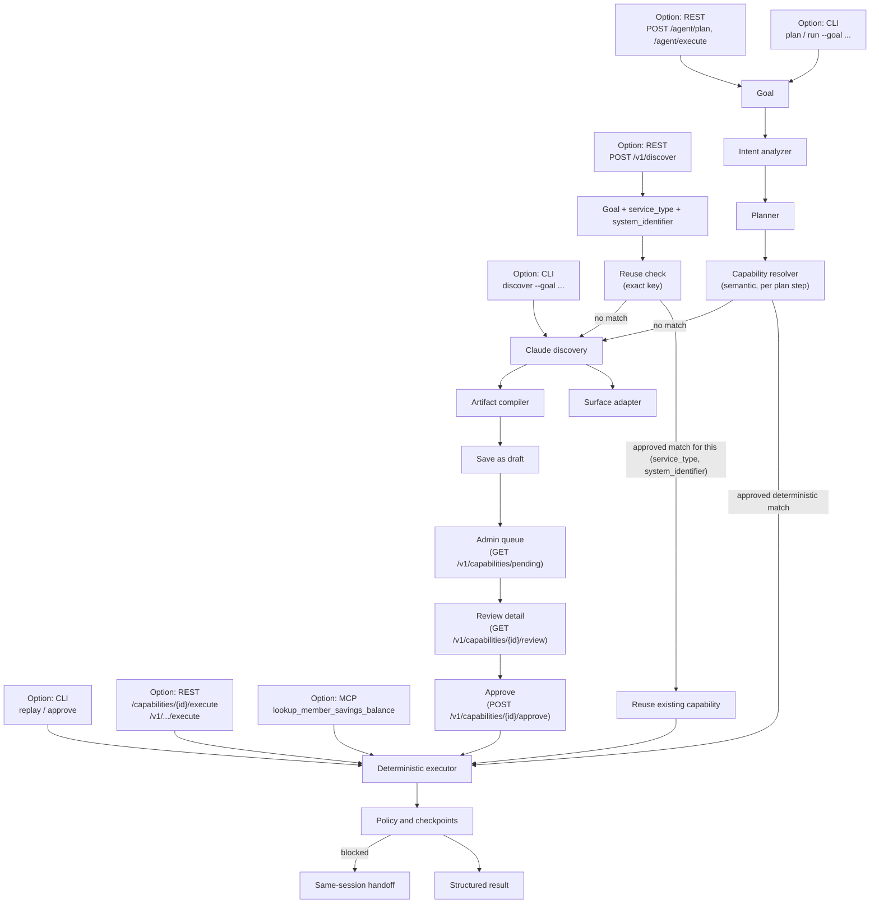

# Computer-Use Capability Platform

A production-oriented vertical slice for the Interface.ai take-home. Claude operates a real
legacy-style web surface once, then compiles the successful trace into a typed, reviewable
capability. Production calls replay that artifact deterministically with Playwright—without an
LLM in the decision loop.

The repository also demonstrates extensibility through a normalized capability registry,
dependency-free semantic retrieval, composable skills, a grounded result synthesizer, a REST
API, and an MCP server. These surround rather than weaken the required computer-use core.

Just want it running, without `uv`, plus test/debug commands? See [RUNNING.md](RUNNING.md).

## Architecture



CLI, REST, and MCP are three interface *options* onto the same core, not three separate
implementations — `list_capabilities` (REST `/capabilities`, MCP) and every execute/replay path
converge on the same `ArtifactStore`/`ReplayEngine`. Two independent resolution paths exist and
both fall through to the same Claude discovery / deterministic executor:
`capability-platform plan`/`run` and `POST /agent/plan`/`/agent/execute` route a free-text goal
through the semantic `CapabilityResolver` (`agent/orchestrator.py`, per plan step — see "Goal →
capability resolution" below); `POST /v1/discover` uses a separate, older exact-key reuse check
(`(service_type, system_identifier)`) that predates it and is unchanged.

**What's actually wired up today, precisely:** `POST /v1/discover` is the live, goal-routed
resolver — `discover_v1` (`src/capability_platform/api/v1_routes.py`) calls
`ArtifactStore.find_approved_by_service_and_system(service_type, system_identifier)` first; a hit
returns the existing `capability_id` with `reused_existing_capability: true` and triggers no
Claude call, and a miss runs Claude discovery, compiles the artifact, and saves it as `draft`
(requiring an explicit `/v1/capabilities/{id}/approve` by an admin credential before it's
invocable). The response also carries `approval_required`, computed from that same lifecycle
gate, as an explicit signal rather than making the client infer it from `lifecycle`. This reuse
path is cross-client by design: whichever client discovered a `(service_type, system_identifier)`
pair first, every later caller for that same pair reuses it.
`tests/test_v1_api_e2e.py` and `tests/test_v1_api_auth.py` exercise both branches end-to-end.

An admin no longer has to know a draft exists — `GET /v1/capabilities/pending` (`Q` above) lists
every not-yet-approved capability, and `GET /v1/capabilities/{id}/review` (`W`) shows the full
compiled plan plus `requested_by` (who asked, and their literal `goal` text, joined from
`InquiryRecord`) before they call the unchanged `/approve`. See
[docs/REST_API_TEST_SCENARIOS.md §6](docs/REST_API_TEST_SCENARIOS.md#6-admin-approval-queue) for
real captured examples of all three.

The plain CLI (`discover --goal "..."`) and the unauthenticated REST/MCP surfaces predate the
resolver work entirely and remain separate, explicit entry points: `discover` always runs a
fresh Claude discovery (no resolution step at all), and `replay <capability-id> --input ...`,
REST's unauthenticated `/capabilities/{id}/execute`, and MCP's `lookup_member_savings_balance`
all require the exact capability id/name. `/v1/discover`'s resolver's match key is the exact
`(service_type, system_identifier)` pair, not free-text goal similarity.

### Goal → capability resolution

`capability-platform plan`/`run` and `POST /agent/plan`/`POST /agent/execute` are the
natural-language entry points: a free-text goal is never sent straight to Claude computer-use
discovery. It's routed through, in order —

1. **Intent Analyzer** (`agent/intent_analyzer.py`) — an LLM call (pluggable provider,
   `llm/{anthropic,openai,mock}_provider.py`) that extracts a structured `TaskIntent`: intent id,
   entities, required outputs, read/write operation, risk, confidence. Never executes anything.
2. **Planner** (`agent/planner.py`) — deterministic, no LLM call. Converts the intent into one or
   more `PlanStep`s with declared inputs/outputs/dependencies. A compound goal ("find member, get
   the balance, and create a note") is decomposed via `TaskIntent.sub_goals` — populated by the
   *same* intent-analysis call, not a second LLM call — into sequential steps; a single-action
   goal uses a small template registry keyed by intent id, or one generic step wrapping the whole
   goal if no template matches.
3. **PlanValidator** (`agent/plan_validator.py`) — rejects cyclic dependencies, missing inputs,
   and malformed plans; flags steps needing approval via the existing `PolicyEngine`.
4. **CapabilityResolver** (`capabilities/resolver.py`) — per step, queries `CapabilityRegistry`
   (now wired into the real runtime via `capabilities/registry.py::build_registry`, not just its
   own unit test), checks exact input/output/trust/policy/tenant compatibility, ranks usable
   candidates by source priority + reliability + trust (`capabilities/ranking.py`), and selects
   the best deterministic match — or falls back to `COMPUTER_USE_DISCOVERY` only when nothing
   approved fits.
5. **Executor / Orchestrator** (`capabilities/executor.py`, `agent/orchestrator.py`) — a
   selected deterministic capability runs through the real, unmodified `ReplayEngine`; an
   unresolved step falls through to the real, unmodified `ClaudeDiscoveryAgent`. Results are
   deterministically aggregated (exact-key dict copy, no LLM) and formatted by an extended
   `GroundedSynthesizer` that takes no LLM output as input — it cannot alter a canonical value.

```bash
uv run capability-platform plan --goal "Get the savings balance for member 10002"   # resolve only, nothing executes
uv run capability-platform run  --goal "Get the savings balance for member 10002"   # resolves AND executes
```
Real captured output for the `run` command above: resolves to `lookup-member-savings-balance.v1`
via `COMPUTER_USE_CAPABILITY` (no new discovery — evidence shows no `discovery.fallback_started`
event) and executes through the real `ReplayEngine`:
```json
{ "status": "success", "outputs": { "savingsBalance": 1220.0 } }
```
When no approved capability matches, the same command genuinely falls back to Claude discovery —
proven with a real run against an isolated, empty artifact directory (so it couldn't touch the
real capability catalog even accidentally):
```bash
ARTIFACT_DIR=/tmp/verify-artifacts HEADLESS=true uv run capability-platform run \
  --goal "Get the savings balance for member 10002"
```
Real captured result: `resolutions[0].resolution_type == "computer_use_discovery"`, a genuine
Claude-driven discovery run against the live demo app produces a new draft artifact, and the
overall result is `"status": "paused"` pending admin approval — evidence shows
`discovery.fallback_started` before a real `discovery.observed`/`discovery.decided`/
`discovery.acted` loop. See `TASKS.md` (Phase 9) for the full evidence trail and run ids.

**Discovery isn't hardcoded to the savings-balance scenario.** A goal shaped nothing like it —
still one live Claude call, real demo app, isolated artifact directory — produces a genuinely
different artifact:
```bash
ARTIFACT_DIR=/tmp/verify-artifacts HEADLESS=true uv run capability-platform run \
  --goal "Find member 10001 and confirm their account status is Active"
```
Real captured artifact (`/tmp/verify-artifacts/retrieve-member-account-status.v1.json`): the
model declared and the loop re-verified its own completion checkpoint
(`"strategy": "text", "value": "Status: Active"`, not the old fixed "Savings Account" oracle),
`name: "Retrieve Member Account Status"`, `outputs: [{"name": "accountStatus", "type": "string"}]`
— all steered by the resolved `TaskIntent`, not hardcoded. See `TASKS.md` (Phase 10).

**Compound goals genuinely decompose, for real.** The exact 3-part goal from example 3 now
resolves each step independently through a live call — no mocking:
```bash
uv run capability-platform plan --goal "Find member 10001, retrieve the savings balance, and create a servicing note" \
  --context "note=Balance confirmed with member"
```
Real captured resolutions: `step-1` (lookup member) → `computer_use_discovery`; `step-2`
(retrieve balance) → `computer_use_capability`, selecting the real
`lookup-member-savings-balance.v1`; `step-3` (create note) → `computer_use_discovery` — three
steps, three independently-resolved outcomes, exactly what "each plan step may resolve to a
different capability source" means. (Omit `--context note=...` and the command fails closed with
a clean 400/error instead of guessing at note content — `PlanValidator` rejects an unsatisfiable
plan rather than proceeding.)

The full design and trade-offs are in [REPORT.md](REPORT.md).

## Requirements

- Python 3.11+
- `uv` (recommended) or pip
- An Anthropic API key for genuine discovery (primary provider)
- Optionally, an OpenAI API key — used only as a per-call fallback if a single Anthropic call
  errors mid-discovery, never as a default
- Chromium installed through Playwright

## Setup

```bash
cp .env.example .env
# Add ANTHROPIC_API_KEY to .env; optionally OPENAI_API_KEY too (see below)
make install
```

Without a model key, deterministic replay, the REST API, the demo app, MCP exposure, and tests
still work. Only `discover` requires the key.

**OpenAI as a discovery fallback, not a default.** Claude is always the primary discovery
provider. If a single Anthropic call errors mid-run (connection, timeout, rate limit, 5xx, or
auth failure), that one decision falls back to `OPENAI_MODEL` (default `gpt-5-mini`) instead of
aborting the whole run — Claude is retried again on the next step. Set `OPENAI_API_KEY` in
`.env` to enable it; leave it unset and Anthropic errors propagate exactly as before. See
`tests/test_discovery_fallback.py` (mocked, no real keys needed) and `evidence/README.md` for a
real end-to-end run where Anthropic was genuinely broken and GPT-5 mini completed the discovery.

## Exact demo path

Terminal 1:

```bash
make demo
```

Terminal 2 - real Claude discovery against the live demo surface:

```bash
make discover
```

This writes `artifacts/lookup-member-savings-balance.v1.json` and a redacted trace under
`evidence/runs/<run-id>/`.

Now run the production path. The replay engine imports no model client and makes no model call:

```bash
make replay
uv run capability-platform replay lookup-member-savings-balance.v1 --input memberId=99999
```

Expected results:

- `10002` → `success`, `savingsBalance: 1220.0`
- `99999` → `business_outcome`, `MEMBER_NOT_FOUND`

## REST and MCP interfaces

Both REST and MCP are thin adapters over the same `ArtifactStore`/`ReplayEngine` service — same
lifecycle gate, same deterministic execution, same result shape. Neither imports or can invoke
an LLM client; both only ever call `ReplayEngine.execute(...)`, the same code path proven
LLM-free by `tests/test_replay_e2e.py::test_replay_never_instantiates_llm_client`.

**Only `approved`/`active` capabilities are exposed or invocable.** A freshly discovered
artifact starts `lifecycle: "draft"` and is deliberately excluded from both `/capabilities` and
MCP's `list_capabilities`, and rejected (`403`) if invocation is attempted directly by id.
Approve one with:

```bash
uv run capability-platform approve lookup-member-savings-balance.v1
```

### REST

```bash
make platform
curl http://127.0.0.1:8000/capabilities
```

```json
[
  {
    "id": "lookup-member-savings-balance.v1",
    "name": "Lookup member savings balance",
    "inputs": [
      {
        "name": "memberId",
        "type": "string",
        "description": "Demo member identifier",
        "required": true,
        "sensitive": false,
        "pattern": "^\\d{5}$"
      }
    ],
    "outputs": [
      { "name": "savingsBalance", "type": "number", "description": "Current savings balance", "sensitive": false }
    ]
  }
]
```

```bash
curl -X POST http://127.0.0.1:8000/capabilities/lookup-member-savings-balance.v1/execute \
  -H 'content-type: application/json' -d '{"inputs":{"memberId":"10002"}}'
```

```json
{
  "run_id": "0db50b6f-d52b-4e72-842b-5b7887be993b",
  "status": "success",
  "capability_id": "lookup-member-savings-balance.v1",
  "outputs": { "savingsBalance": 1220.0 },
  "business_code": null,
  "error": null,
  "intervention_id": null,
  "started_at": "2026-09-15T22:02:03.031012Z",
  "completed_at": "2026-09-15T22:02:04.410496Z"
}
```

That's the identical `ExecutionResult` shape the CLI prints (`run_id`, `status`, `capability_id`,
`outputs`, `business_code`, `error`, `intervention_id`, `started_at`, `completed_at`) — REST
doesn't reshape or duplicate it. Both responses above are real output, captured from a local run
against `artifacts/lookup-member-savings-balance.v1.json` and the demo app on port 8001.

### REST: authenticated `/v1` surface

The routes above are unauthenticated and remain for local/demo convenience. Any real caller goes
through `/v1` instead: every route requires HTTP Basic auth against a registered
`ClientCredential`, `discover`/`execute` also check the credential is authorized for the
capability's `service_type` (`require_service_type` in `src/capability_platform/api/auth.py`),
and every call is recorded as an `InquiryRecord` (`client_id`, `client_inquiry_id`,
`service_type`, `system_identifier`, reuse/execution status) via `InquiryTracker` — see
`src/capability_platform/api/v1_routes.py` for the route handlers and
`src/capability_platform/api/schemas/{requests,responses}.py` for the request/response contract
itself, kept in its own folder so it's one clean, browsable place rather than mixed in with
handler logic.

Register a client first (password is hashed with PBKDF2 before it touches disk — see
`access/credentials.py`):

```bash
uv run capability-platform register-client --client-id demo-client --password secret123 \
  --service-type member_savings_balance_lookup --admin
```

Then drive the same discover → approve → execute flow the CLI and `test_v1_api_e2e.py` exercise,
now over REST with credentials and request tracking:

```bash
make platform

# Discover (or reuse, if this service_type + system_identifier pair was already discovered by
# any client) a capability against a system pre-approved in config/system_registry.json.
curl -X POST http://127.0.0.1:8000/v1/discover -u demo-client:secret123 \
  -H 'content-type: application/json' -d '{
    "service_type": "member_savings_balance_lookup",
    "system_identifier": "legacy-member-servicing-demo",
    "client_inquiry_id": "client-req-001",
    "goal": "Find member 10001 and return savings balance"
  }'
```

```json
{
  "capability_id": "lookup-member-savings-balance.v1",
  "inquiry_id": "b2b7a9c1-2f2b-4e9b-8b0b-6a6b9f9e6a11",
  "reused_existing_capability": false,
  "lifecycle": "draft",
  "approval_required": true
}
```

`reused_existing_capability: false` means no prior *approved* capability matched this
`(service_type, system_identifier)` pair, so Claude discovery ran and produced a new `draft`
artifact — it isn't invocable yet (`approval_required: true`). A later `/v1/discover` call with
the same pair, once approved, returns the same `capability_id` with
`reused_existing_capability: true` and `approval_required: false`, triggering no Claude call at
all, per `find_approved_by_service_and_system` (`capabilities/store.py`).

Before approving, an admin can find and inspect this draft over REST — no local filesystem/CLI
access required:

```bash
curl -X GET http://127.0.0.1:8000/v1/capabilities/pending -u demo-client:secret123
curl -X GET http://127.0.0.1:8000/v1/capabilities/lookup-member-savings-balance.v1/review \
  -u demo-client:secret123
```

The first lists every pending capability (summary only); the second returns the full compiled
plan — every step, locator, and risk level — plus `requested_by`: who asked and their literal
`goal` text, joined from every `InquiryRecord` that named this `capability_id`. Both are
admin-only (`credential.is_admin`, same gate as `/approve`) and unrelated to `require_service_type`
— see [docs/REST_API_TEST_SCENARIOS.md §6](docs/REST_API_TEST_SCENARIOS.md#6-admin-approval-queue)
for real captured request/response pairs.

```bash
# Approve (admin credential only — draft artifacts are not invocable by anyone until this).
curl -X POST http://127.0.0.1:8000/v1/capabilities/lookup-member-savings-balance.v1/approve \
  -u demo-client:secret123
```

```json
{ "capability_id": "lookup-member-savings-balance.v1", "lifecycle": "approved" }
```

```bash
# Execute — same ExecutionResult shape as the unauthenticated route, plus an InquiryRecord logged
# under this client_id.
curl -X POST http://127.0.0.1:8000/v1/capabilities/lookup-member-savings-balance.v1/execute \
  -u demo-client:secret123 -H 'content-type: application/json' -d '{
    "client_inquiry_id": "client-req-002",
    "inputs": {"memberId": "10002"}
  }'
```

```json
{
  "run_id": "47eec817-3c09-4c15-914a-be0a5bd93286",
  "status": "success",
  "capability_id": "lookup-member-savings-balance.v1",
  "outputs": { "savingsBalance": 1220.0 },
  "business_code": null,
  "error": null,
  "intervention_id": null,
  "started_at": "2026-09-15T22:01:25.979696Z",
  "completed_at": "2026-09-15T22:01:27.574779Z"
}
```

And the recoverable business outcome for a member that doesn't exist (`memberId: "99999"`),
captured from the same run — `status` distinguishes this from a hard failure, per
[Architecture rules #6](CLAUDE.md):

```json
{
  "run_id": "e744e718-d5d6-4c63-a640-50958996649b",
  "status": "business_outcome",
  "capability_id": "lookup-member-savings-balance.v1",
  "outputs": {},
  "business_code": "MEMBER_NOT_FOUND",
  "error": null,
  "intervention_id": null,
  "started_at": "2026-09-15T22:01:27.711077Z",
  "completed_at": "2026-09-15T22:01:28.472516Z"
}
```

Omitting `-u`, using wrong credentials, or using a credential not authorized for the capability's
`service_type` all fail closed (`401`/`403`) before any replay runs — see
`tests/test_v1_api_auth.py`. The execute responses above are real output, captured from a local
run with `demo-client` (registered exactly as shown above) against the same approved artifact.

### REST: agent-facing goal resolution (`/agent/plan`, `/agent/execute`)

Same authenticated `/v1`-style surface (`Depends(authenticate_client)`), but the request is a
free-text `goal` instead of a `service_type`/`system_identifier` pair — see
"Goal → capability resolution" above for the pipeline this drives.

```bash
curl -X POST http://127.0.0.1:8000/agent/execute -u demo-client:secret123 \
  -H 'content-type: application/json' -d '{
    "goal": "Get the savings balance for member 10002",
    "client_inquiry_id": "doc-example-1"
  }'
```

Real captured output (abbreviated — the full response also includes `intent`, `plan`, and
`resolutions` for auditability):

```json
{
  "run_id": "aafceb78-6f6f-43ab-a70d-53d24056e4f9",
  "result": {
    "status": "success",
    "outputs": { "savingsBalance": 1220.0 },
    "business_code": null,
    "synthesized_text": "Completed 'retrieve_account_balance'. savingsBalance: 1220.0"
  }
}
```

`resolutions[0].resolution_type == "computer_use_capability"` and
`resolutions[0].selected.descriptor.id == "lookup-member-savings-balance.v1"` — resolved to the
existing artifact, zero new discovery. `POST /agent/plan` takes the same request shape and runs
identical resolution but executes nothing (no `execution`/`result` in the response — just
`intent`, `plan`, `resolutions`), for a dry-run preview of what a goal would resolve to.

A capability with a `service_type` the calling credential isn't authorized for is rejected the
same way `/v1/capabilities/{id}/execute` rejects one (`error.code == "SERVICE_TYPE_NOT_AUTHORIZED"`
in the per-step `execution` entry, not a blanket `403` — since a multi-step plan could in
principle resolve different steps to different service types). See `tests/test_agent_api.py`.

### MCP

```bash
make mcp
```

This runs the exact command registered in `.mcp.json`
(`uv run python -m capability_platform.mcp.server`, stdio transport) and exposes two tools:
`list_capabilities` and `lookup_member_savings_balance`. External MCP servers would enter through
an allowlisted client adapter and normalize to the same descriptor; automatic internet-wide
installation is intentionally not implemented.

**How another Claude (or any MCP-compatible agent) discovers and invokes it:** Claude Code reads
`.mcp.json` at the repo root and auto-starts `learned-capabilities` as a local MCP server for the
session — no manual registration needed inside this repo. Any MCP client does the same three
steps regardless of language/host:

1. Connect over stdio and call `list_tools()` — returns `list_capabilities` and
   `lookup_member_savings_balance` with their JSON-schema input contracts.
2. Call `list_capabilities` to see what's approved and invocable right now (empty until at least
   one artifact is approved, per the gate above).
3. Call `lookup_member_savings_balance` with typed args, e.g. `{"member_id": "10002"}` — the
   agent gets back the same structured `ExecutionResult` as REST/CLI, with no LLM call made on
   this path.

`tests/test_mcp_server.py` demonstrates exactly this against the real server as an automated
test (not a mock): it spawns the server subprocess, lists tools, calls `list_capabilities`, then
calls `lookup_member_savings_balance` and asserts on the real result.

Claude Code also reads `CLAUDE.md` and has two project skills under `.claude/skills/`: `run-demo`
and `review-artifact`.

## Human handoff demo

A declared `pause` error rule (e.g. an unexpected interstitial the automation can't safely
dismiss on its own) creates an intervention carrying the run, capability, step, reason,
accessibility state, and screenshot, while the same browser/session remains the control
boundary. This is exercised end-to-end, against the live demo app, by
`tests/test_intervention.py` — member `10003`'s search result always includes an injected
"Session Notice" interstitial (`demo_app/app.py`) for exactly this purpose:

```bash
uv run pytest -q -m e2e tests/test_intervention.py
```

That test also covers the negative case: resuming *without* dismissing the condition first
fails hard with a clear message rather than silently proceeding.

To drive it manually: run with `HEADLESS=false`, trigger a pause, inspect `GET /interventions`,
operate the visible browser by hand, then call:

```bash
curl -X POST http://127.0.0.1:8000/interventions/<id>/resume
```

The in-memory implementation proves control ownership and same-session continuity. A production
operator console would remotely attach to the same isolated browser worker.

**Risky/irreversible steps also route to a human, via the same mechanism.** Before executing
any step above the policy's risk threshold, `ReplayEngine` pauses and creates an intervention
(same shape as above) instead of a plain `pause` error rule. Approve or deny it explicitly:

```bash
curl -X POST http://127.0.0.1:8000/interventions/<id>/resume \
  -H 'content-type: application/json' -d '{"approved": true}'
```

A denial (`{"approved": false}`, or simply not approving) fails the run with a structured
`category=policy, code=APPROVAL_DENIED` error rather than proceeding — it's never silently
treated as approved. See `tests/test_approval.py` for both outcomes exercised end-to-end.

`Intervention.kind` (`"pause"` vs `"approval"`, `intervention/manager.py`) tells the two shapes
above apart without parsing `reason` text — used by the admin dashboard (below) to show the
right action buttons. **Same-session proof, concretely, not just by design:** `ReplayEngine`
logs `page_identity = id(surface.page)` — CPython's object identity for the live Playwright
`Page` — into `evidence/runs/<run_id>/events.jsonl` at `intervention.created` and again after
resume; identical values on both sides prove the exact same in-process browser session was
reused, not a new one substituted in. Two throwaway demo capabilities
(`scripts/debug/create_pause_demo_capability.py`, `create_approval_demo_capability.py` — or the
admin dashboard's one-click "Seed demo capabilities" button) exist purely to drive both flows
live against a capability that isn't otherwise pause/risk-enabled.

## Admin dashboard

`GET /admin` (open `http://127.0.0.1:8000/admin` once `make platform` is running) is a single
local page that consolidates every flow above into one click-through demo: client initiate
(`/v1/discover`), pending artifacts → review → approve, execute (success / business-outcome /
failure), both intervention flows with the same-session proof rendered inline, an observability
event-trace viewer, and client-side statistics — each section carries an "Implements:" note
citing the exact file/function it demonstrates. Plain HTML/CSS/vanilla JS, no build step, no
framework, same-origin `fetch()` calls only — deliberately not a Claude Artifact, since an
Artifact runs in a sandboxed browser on claude.ai and can't reach this machine's `127.0.0.1`.

Three small endpoints exist purely to support it (local-demo-only, unauthenticated, not part of
the versioned `/v1` contract): `GET /runs/{run_id}/events` (reads back a run's redacted evidence
trace), `POST /admin/seed-demo-capabilities` (one-click version of the two scripts above), and
`POST /admin/reset-to-draft/{capability_id}` (flips an approved capability back to `draft` with
no Claude call, so the approve flow can be re-demoed instantly and repeatably). See
[docs/REST_API_TEST_SCENARIOS.md §8](docs/REST_API_TEST_SCENARIOS.md#8-new-demo-only-endpoints)
for curl examples of all three, and
[docs/ARCHITECTURE_WALKTHROUGH.md](docs/ARCHITECTURE_WALKTHROUGH.md) for the full demo script
this page walks.

**Client initiate also shows the real target URL and can watch discovery happen live.** A
"Target resource type" selector comes first — `URL (web)` is the only functional option in this
demo; `Executable (.exe)`, `URL with iFrame`, and `Other surface (custom)` are shown selectable
but disable the form with a note explaining why: every surface-specific action already sits
behind one abstraction, `SurfaceAdapter` (`computer_use/surface.py`, architecture rule #8), with
`PlaywrightSurface` as its only implementation today, so those options are genuine extension
points, not a hollow prop. Below that, the `system_identifier` field is a `<select>` populated
from `GET /v1/systems`, showing each
option's actual URL — or check "Use a direct URL instead" to bypass the registry and discover
against any allowlisted URL directly. A "Requires login?" toggle reveals `example_username`/
`example_password` fields for the auth-required flow below. While discovery runs (30-90s), a live
progress panel polls `GET /runs/{run_id}/events` and streams each step as Claude decides it —
action, locator, reasoning — instead of just a final result. "Force re-discover" re-runs
discovery against an already-approved capability instead of reusing it, updating it in place. A
"Test app" section previews the target demo app in an iframe (a manual preview only — not a live
view of the separate, Playwright-controlled automation browser).

**Auth-required discovery, for real.** `demo_app/app.py` has a second area, `/secure/*`
(credentials `demo` / `letmein-2024`, obviously a demo fixture, not a real secret), gating the
same member-search flow behind a login form — registered as a second system,
`legacy-member-servicing-demo-secure`, in `config/system_registry.json`. Claude discovers the
login form itself, the same observe→decide→act loop as everything else, and the compiled
artifact only ever retains `{{username}}`/`{{password}}` placeholders — never the literal
credential. `auth_type` selects `"credentials"` (username + password, the default) or
`"api_key"` (a single `apiKey`) — same underlying mechanism either way
(`ClaudeDiscoveryAgent._credential_input_specs`), no per-type discovery logic. There's no
field-name matching on our side for either: Claude matches each named credential to a labeled
input itself, the same way it already finds the member-search box. See
[docs/REST_API_TEST_SCENARIOS.md §9](docs/REST_API_TEST_SCENARIOS.md#9-auth-required-discovery-login-gated-legacy-app)
for the full walkthrough with real captured output.

## Tests

```bash
make test
make lint
```

`make test` runs the deterministic unit suite only (`-m "not e2e"`) and needs nothing running.
The browser-dependent tests (replay, MCP, and human-handoff scenarios against the real demo app)
are opt-in — start the demo app first, then:

```bash
make demo          # terminal 1
make test-e2e       # terminal 2, equivalent to: uv run pytest -q -m e2e
```

## Debugging

`.vscode/launch.json` has a debugpy config per moving part (`justMyCode: false` throughout, so
you can step into library code — Playwright, FastAPI, the Anthropic SDK — too). The ones most
relevant to tracing a discovery run:

- **"Debug: v1 discover flow (resolver reuse + Claude discovery + approve + execute)"** runs
  `scripts/debug/discover_v1_flow.py`, which drives the full authenticated `/v1` client lifecycle
  in one process — the same sequence a real client's REST integration would make:
  1. `POST /v1/discover` — the resolver calls `ArtifactStore.find_approved_by_service_and_system`
     first; on a miss (the common case for a first-time `(service_type, system_identifier)` pair)
     it falls through to `ClaudeDiscoveryAgent.discover`, which drives a real, visible (non-
     headless) Chromium against the demo app on port 8001.
  2. `POST /v1/capabilities/{id}/approve` — the resulting `draft` artifact isn't invocable until
     an admin credential approves it.
  3. `POST /v1/capabilities/{id}/execute` — deterministic Playwright replay, no LLM in this path.
  4. `POST /v1/discover` again with the same pair — now `reused_existing_capability: true`, and
     `ClaudeDiscoveryAgent.discover` is never called.

  It uses a throwaway temp directory for `artifact_dir`/`credential_dir`/`tracking_dir`
  (mirroring `tests/test_v1_api_e2e.py`), so it never touches the real `artifacts/` or `data/`
  under the repo root and is safe to re-run. It **does** make a genuine, billed Claude API call
  in step 1 — this isn't mocked, because the discovery decision loop is exactly what you're
  debugging. Start `make demo` on port 8001 first, and have `ANTHROPIC_API_KEY` set (`.env`).

  Useful breakpoints: `v1_routes.discover_v1` (the resolver entry point),
  `ArtifactStore.find_approved_by_service_and_system` (the reuse check itself — step over it on
  the first call to watch it return `None`, then hit it again on the fourth call and watch it
  return the approved artifact), `ClaudeDiscoveryAgent._decide` (one breakpoint hit per
  observe-decide-act step — inspect `response.content` for the model's `browser_action` tool
  call each time), and `v1_routes.execute_v1` (the `service_type` re-check before replay).

- **"Debug: v1 API auth/authz tests"** and **"Debug: v1 API e2e (real discovery, real replay)"**
  step through `tests/test_v1_api_auth.py` (401/403 paths — no Claude/browser needed) and
  `tests/test_v1_api_e2e.py` (the same real discover → approve → execute round trip as the
  script above, as an assertion-driven test instead of a printed trace).

- **"Debug: platform API (port 8000)"** / **"Debug: demo app (port 8001)"** launch the actual
  servers under the debugger with `--reload`, for when you'd rather drive requests by hand (curl,
  or the [REST: authenticated `/v1` surface](#rest-authenticated-v1-surface) examples above) and
  hit breakpoints as they arrive, instead of running a scripted sequence.

- **"Debug: MCP tool invocation (direct call)"** runs `scripts/debug/mcp_tool_invocation.py`,
  which calls the generated MCP tool function directly — bypassing the stdio/JSON-RPC
  transport — so it can be single-stepped without a second connected MCP client process.

- **"Debug: create pause-demo capability (human handoff)"** / **"Debug: create approval-demo
  capability (risky-step approval)"** run the two `scripts/debug/create_*_demo_capability.py`
  scripts (shared builder logic in `capabilities/demo_seed.py`) — saves a throwaway capability
  with a pause `ErrorRule` or a `RISKY` step injected, so the intervention flows are drivable
  against a real capability instead of only inside a test process. The admin dashboard's "Seed
  demo capabilities" button does the same thing over REST.

- **"Debug: intervention/handoff test (pause + resume)"** / **"Debug: risky-action approval
  test"** step through `tests/test_intervention.py` / `tests/test_approval.py` — both real
  `ReplayEngine` runs (no Claude, no API key needed), just against an in-memory-modified copy of
  the artifact rather than a saved one.

### How a client actually drives the REST flow

Concretely, an integrating client's REST call sequence is: **register once** (out-of-band, via
`register-client` — see [REST: authenticated `/v1` surface](#rest-authenticated-v1-surface)),
then for every inquiry, **discover** with its own `client_inquiry_id` plus the `service_type` and
`system_identifier` it wants (cheap and instant if any client already discovered that exact pair
and it's approved; otherwise a real discovery run happens on the client's behalf), then **execute**
using the returned `capability_id` once it's `approved`. A client never needs to know or supply
step-by-step browser instructions — `service_type` + `system_identifier` + a natural-language
`goal` is the entire contract on the way in, and a typed `ExecutionResult` is the entire contract
on the way out. `approve` is deliberately not part of a client's normal path — it's an
admin-only gate (`credential.is_admin`), so a `draft` artifact a client's own discovery call
produced still needs separate sign-off before anyone, including that same client, can execute it.
On the admin side, `GET /v1/capabilities/pending` and `GET /v1/capabilities/{id}/review`
(both admin-only) are how that sign-off actually gets triggered — an admin doesn't need local
filesystem or CLI access just to find out a draft exists.

## Repository map

| Path | Responsibility |
|---|---|
| `agent/` | Claude observe-decide-act discovery; intent analysis, planning, and orchestration (`models.py`, `intent_analyzer.py`, `planner.py`, `plan_validator.py`, `orchestrator.py`) |
| `llm/` | Provider-independent LLM seam (`provider.py` Protocol; Anthropic/OpenAI/mock implementations) |
| `models.py` | Typed artifact and result contracts |
| `computer_use/` | Surface seam and no-LLM replay |
| `capabilities/` | Artifact store, semantic registry (now wired into the real runtime), resolver, ranking, executor |
| `policy/` | Independent URL, action, and risk authorization |
| `intervention/` | Control ownership and resume signal |
| `observability/` | Redacted JSONL evidence and screenshots |
| `skills/` | Higher-level composition example |
| `mcp/` | Agent-facing MCP exposure |
| `demo_app/` | Synthetic legacy banking proxy |

## Security notes

- Use synthetic data only.
- Browser observations and tool results are treated as untrusted data.
- Policy decisions happen outside Claude.
- Secrets, SSNs, and authorization values are redacted before persistence in structured logs
  (`uv run python scripts/validate_evidence.py` checks this over the whole evidence tree);
  screenshots are not redacted — synthetic data only, by design.
- Risky/irreversible actions above the configured threshold pause for human approval before
  they run, reusing the same same-session intervention mechanism as an unexpected-condition
  handoff: `PolicyEngine.requires_approval(step)` gates the step, a human calls
  `POST /interventions/<id>/resume` with `{"approved": true|false}`, and a denial fails the run
  with a clear `APPROVAL_DENIED` error rather than proceeding. See "Human handoff demo" above
  and `tests/test_approval.py`.
- Do not commit `.env` or browser session state.
