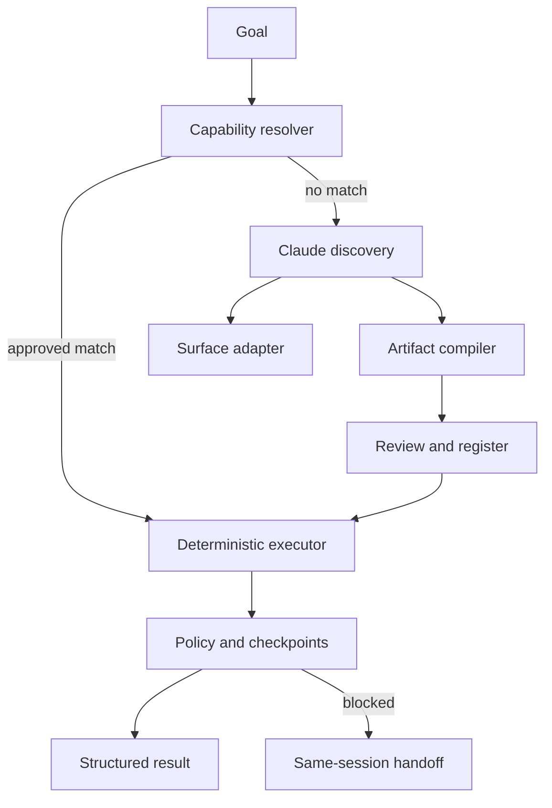

# Computer-Use Capability Platform

A production-oriented vertical slice for the Interface.ai take-home. Claude operates a real
legacy-style web surface once, then compiles the successful trace into a typed, reviewable
capability. Production calls replay that artifact deterministically with Playwright—without an
LLM in the decision loop.

The repository also demonstrates extensibility through a normalized capability registry,
dependency-free semantic retrieval, composable skills, a grounded result synthesizer, a REST
API, and an MCP server. These surround rather than weaken the required computer-use core.

## Architecture



The full design and trade-offs are in [REPORT.md](REPORT.md).

## Requirements

- Python 3.11+
- `uv` (recommended) or pip
- An Anthropic API key only for genuine discovery
- Chromium installed through Playwright

## Setup

```bash
cp .env.example .env
# Add ANTHROPIC_API_KEY to .env
make install
```

Without a model key, deterministic replay, the REST API, the demo app, MCP exposure, and tests
still work. Only `discover` requires the key.

## Exact demo path

Terminal 1:

```bash
make demo
```

Terminal 2 - real Claude discovery against the live demo surface:

```bash
make discover
```

This writes `artifacts/lookup-member-savings-balance.v1.json` and a redacted trace under
`evidence/runs/<run-id>/`.

Now run the production path. The replay engine imports no model client and makes no model call:

```bash
make replay
uv run capability-platform replay lookup-member-savings-balance.v1 --input memberId=99999
```

Expected results:

- `10002` → `success`, `savingsBalance: 1220.0`
- `99999` → `business_outcome`, `MEMBER_NOT_FOUND`

## REST and MCP interfaces

```bash
make platform
curl http://127.0.0.1:8000/capabilities
curl -X POST http://127.0.0.1:8000/capabilities/lookup-member-savings-balance.v1/execute \
  -H 'content-type: application/json' -d '{"inputs":{"memberId":"10002"}}'
```

Expose learned capabilities to MCP-compatible agents:

```bash
make mcp
```

The server exposes `list_capabilities` and `lookup_member_savings_balance`. External MCP servers
would enter through an allowlisted client adapter and normalize to the same descriptor; automatic
internet-wide installation is intentionally not implemented.

Claude Code reads `CLAUDE.md`, automatically discovers the local server from `.mcp.json`, and has
two project skills under `.claude/skills/`: `run-demo` and `review-artifact`.

## Human handoff demo

Run with `HEADLESS=false`. A declared `pause` error rule or risky policy decision creates an
intervention carrying the run, step, state, and screenshot while the same browser/session remains
the control boundary. Inspect `GET /interventions`, manually operate the visible browser, then call:

```bash
curl -X POST http://127.0.0.1:8000/interventions/<id>/resume
```

The in-memory implementation proves control ownership and same-session continuity. A production
operator console would remotely attach to the same isolated browser worker.

## Tests

```bash
make test
make lint
```

Start the demo app before running the opt-in browser test:

```bash
uv run pytest -q -m e2e
```

## Repository map

| Path | Responsibility |
|---|---|
| `agent/` | Claude observe-decide-act discovery |
| `models.py` | Typed artifact and result contracts |
| `computer_use/` | Surface seam and no-LLM replay |
| `capabilities/` | Artifact store and semantic registry |
| `policy/` | Independent URL, action, and risk authorization |
| `intervention/` | Control ownership and resume signal |
| `observability/` | Redacted JSONL evidence and screenshots |
| `skills/` | Higher-level composition example |
| `mcp/` | Agent-facing MCP exposure |
| `demo_app/` | Synthetic legacy banking proxy |

## Security notes

- Use synthetic data only.
- Browser observations and tool results are treated as untrusted data.
- Policy decisions happen outside Claude.
- Secrets, SSNs, and authorization values are redacted before persistence.
- Risky/irreversible actions require human approval.
- Do not commit `.env` or browser session state.
