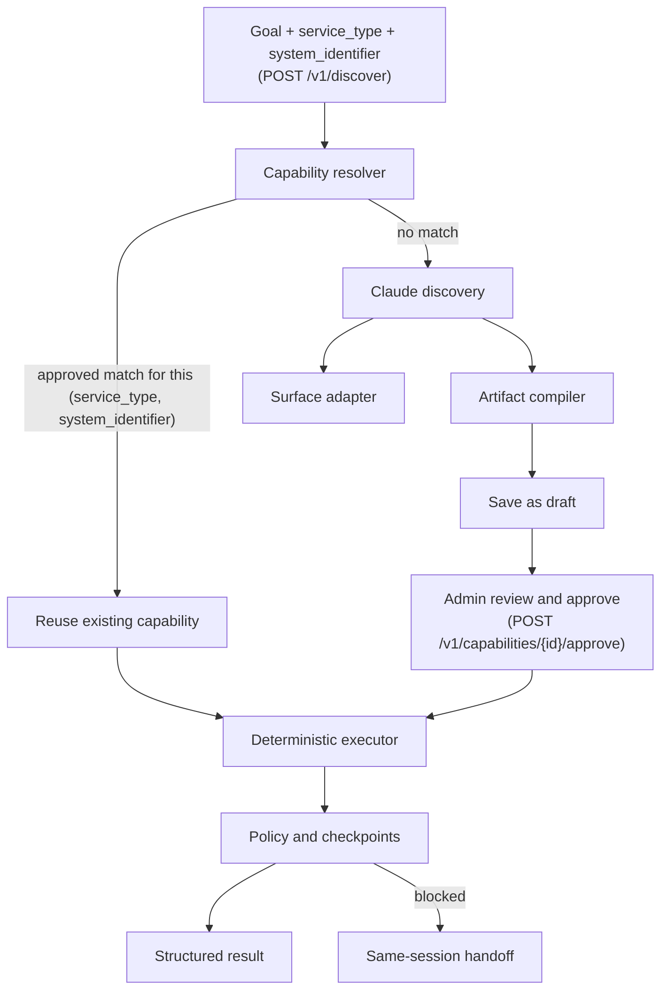

# Computer-Use Capability Platform

A production-oriented vertical slice for the Interface.ai take-home. Claude operates a real
legacy-style web surface once, then compiles the successful trace into a typed, reviewable
capability. Production calls replay that artifact deterministically with Playwright—without an
LLM in the decision loop.

The repository also demonstrates extensibility through a normalized capability registry,
dependency-free semantic retrieval, composable skills, a grounded result synthesizer, a REST
API, and an MCP server. These surround rather than weaken the required computer-use core.

## Architecture



**What's actually wired up today, precisely:** `POST /v1/discover` is the live, goal-routed
resolver — `discover_v1` (`src/capability_platform/api/v1_routes.py`) calls
`ArtifactStore.find_approved_by_service_and_system(service_type, system_identifier)` first; a hit
returns the existing `capability_id` with `reused_existing_capability: true` and triggers no
Claude call, and a miss runs Claude discovery, compiles the artifact, and saves it as `draft`
(requiring an explicit `/v1/capabilities/{id}/approve` by an admin credential before it's
invocable). This reuse path is cross-client by design: whichever client discovered a
`(service_type, system_identifier)` pair first, every later caller for that same pair reuses it.
`tests/test_v1_api_e2e.py` and `tests/test_v1_api_auth.py` exercise both branches end-to-end.

The plain CLI (`discover --goal "..."`) and the unauthenticated REST/MCP surfaces predate this and
remain two separate, explicit entry points rather than going through the resolver: `discover`
always runs a fresh Claude discovery (no reuse check), and `replay <capability-id> --input ...`,
REST's unauthenticated `/capabilities/{id}/execute`, and MCP's `lookup_member_savings_balance`
all require the exact capability id/name. The resolver's match key is the exact
`(service_type, system_identifier)` pair, not free-text goal similarity — `capabilities/registry.py`
(the semantic embedding/reranking retrieval described below) is real, tested code
(`tests/test_models.py::test_semantic_registry_prefers_balance_capability`), but it is not called
from `discover_v1`, the CLI, or MCP; it remains an implemented, unit-tested building block, not
part of any live resolution path.

The full design and trade-offs are in [REPORT.md](REPORT.md).

## Requirements

- Python 3.11+
- `uv` (recommended) or pip
- An Anthropic API key for genuine discovery (primary provider)
- Optionally, an OpenAI API key — used only as a per-call fallback if a single Anthropic call
  errors mid-discovery, never as a default
- Chromium installed through Playwright

## Setup

```bash
cp .env.example .env
# Add ANTHROPIC_API_KEY to .env; optionally OPENAI_API_KEY too (see below)
make install
```

Without a model key, deterministic replay, the REST API, the demo app, MCP exposure, and tests
still work. Only `discover` requires the key.

**OpenAI as a discovery fallback, not a default.** Claude is always the primary discovery
provider. If a single Anthropic call errors mid-run (connection, timeout, rate limit, 5xx, or
auth failure), that one decision falls back to `OPENAI_MODEL` (default `gpt-5-mini`) instead of
aborting the whole run — Claude is retried again on the next step. Set `OPENAI_API_KEY` in
`.env` to enable it; leave it unset and Anthropic errors propagate exactly as before. See
`tests/test_discovery_fallback.py` (mocked, no real keys needed) and `evidence/README.md` for a
real end-to-end run where Anthropic was genuinely broken and GPT-5 mini completed the discovery.

## Exact demo path

Terminal 1:

```bash
make demo
```

Terminal 2 - real Claude discovery against the live demo surface:

```bash
make discover
```

This writes `artifacts/lookup-member-savings-balance.v1.json` and a redacted trace under
`evidence/runs/<run-id>/`.

Now run the production path. The replay engine imports no model client and makes no model call:

```bash
make replay
uv run capability-platform replay lookup-member-savings-balance.v1 --input memberId=99999
```

Expected results:

- `10002` → `success`, `savingsBalance: 1220.0`
- `99999` → `business_outcome`, `MEMBER_NOT_FOUND`

## REST and MCP interfaces

Both REST and MCP are thin adapters over the same `ArtifactStore`/`ReplayEngine` service — same
lifecycle gate, same deterministic execution, same result shape. Neither imports or can invoke
an LLM client; both only ever call `ReplayEngine.execute(...)`, the same code path proven
LLM-free by `tests/test_replay_e2e.py::test_replay_never_instantiates_llm_client`.

**Only `approved`/`active` capabilities are exposed or invocable.** A freshly discovered
artifact starts `lifecycle: "draft"` and is deliberately excluded from both `/capabilities` and
MCP's `list_capabilities`, and rejected (`403`) if invocation is attempted directly by id.
Approve one with:

```bash
uv run capability-platform approve lookup-member-savings-balance.v1
```

### REST

```bash
make platform
curl http://127.0.0.1:8000/capabilities
curl -X POST http://127.0.0.1:8000/capabilities/lookup-member-savings-balance.v1/execute \
  -H 'content-type: application/json' -d '{"inputs":{"memberId":"10002"}}'
```

The execute response is the identical `ExecutionResult` JSON the CLI prints (`run_id`, `status`,
`capability_id`, `outputs`, `business_code`, `error`, `intervention_id`, `started_at`,
`completed_at`) — REST doesn't reshape or duplicate it.

### REST: authenticated `/v1` surface

The routes above are unauthenticated and remain for local/demo convenience. Any real caller goes
through `/v1` instead: every route requires HTTP Basic auth against a registered
`ClientCredential`, `discover`/`execute` also check the credential is authorized for the
capability's `service_type` (`require_service_type` in `src/capability_platform/api/auth.py`),
and every call is recorded as an `InquiryRecord` (`client_id`, `client_inquiry_id`,
`service_type`, `system_identifier`, reuse/execution status) via `InquiryTracker` — see
`src/capability_platform/api/v1_routes.py`.

Register a client first (password is hashed with PBKDF2 before it touches disk — see
`access/credentials.py`):

```bash
uv run capability-platform register-client --client-id demo-client --password secret123 \
  --service-type member_savings_balance_lookup --admin
```

Then drive the same discover → approve → execute flow the CLI and `test_v1_api_e2e.py` exercise,
now over REST with credentials and request tracking:

```bash
make platform

# Discover (or reuse, if this service_type + system_identifier pair was already discovered by
# any client) a capability against a system pre-approved in config/system_registry.json.
curl -X POST http://127.0.0.1:8000/v1/discover -u demo-client:secret123 \
  -H 'content-type: application/json' -d '{
    "service_type": "member_savings_balance_lookup",
    "system_identifier": "legacy-member-servicing-demo",
    "client_inquiry_id": "client-req-001",
    "goal": "Find member 10001 and return savings balance"
  }'
# -> {"capability_id": "...", "inquiry_id": "...", "reused_existing_capability": false, "lifecycle": "draft"}

# Approve (admin credential only — draft artifacts are not invocable by anyone until this).
curl -X POST http://127.0.0.1:8000/v1/capabilities/<capability_id>/approve -u demo-client:secret123

# Execute — same ExecutionResult shape as the unauthenticated route, plus an InquiryRecord logged
# under this client_id.
curl -X POST http://127.0.0.1:8000/v1/capabilities/<capability_id>/execute -u demo-client:secret123 \
  -H 'content-type: application/json' -d '{
    "client_inquiry_id": "client-req-002",
    "inputs": {"memberId": "10002"}
  }'
```

Omitting `-u`, using wrong credentials, or using a credential not authorized for the capability's
`service_type` all fail closed (`401`/`403`) before any replay runs — see
`tests/test_v1_api_auth.py`.

### MCP

```bash
make mcp
```

This runs the exact command registered in `.mcp.json`
(`uv run python -m capability_platform.mcp.server`, stdio transport) and exposes two tools:
`list_capabilities` and `lookup_member_savings_balance`. External MCP servers would enter through
an allowlisted client adapter and normalize to the same descriptor; automatic internet-wide
installation is intentionally not implemented.

**How another Claude (or any MCP-compatible agent) discovers and invokes it:** Claude Code reads
`.mcp.json` at the repo root and auto-starts `learned-capabilities` as a local MCP server for the
session — no manual registration needed inside this repo. Any MCP client does the same three
steps regardless of language/host:

1. Connect over stdio and call `list_tools()` — returns `list_capabilities` and
   `lookup_member_savings_balance` with their JSON-schema input contracts.
2. Call `list_capabilities` to see what's approved and invocable right now (empty until at least
   one artifact is approved, per the gate above).
3. Call `lookup_member_savings_balance` with typed args, e.g. `{"member_id": "10002"}` — the
   agent gets back the same structured `ExecutionResult` as REST/CLI, with no LLM call made on
   this path.

`tests/test_mcp_server.py` demonstrates exactly this against the real server as an automated
test (not a mock): it spawns the server subprocess, lists tools, calls `list_capabilities`, then
calls `lookup_member_savings_balance` and asserts on the real result.

Claude Code also reads `CLAUDE.md` and has two project skills under `.claude/skills/`: `run-demo`
and `review-artifact`.

## Human handoff demo

A declared `pause` error rule (e.g. an unexpected interstitial the automation can't safely
dismiss on its own) creates an intervention carrying the run, capability, step, reason,
accessibility state, and screenshot, while the same browser/session remains the control
boundary. This is exercised end-to-end, against the live demo app, by
`tests/test_intervention.py` — member `10003`'s search result always includes an injected
"Session Notice" interstitial (`demo_app/app.py`) for exactly this purpose:

```bash
uv run pytest -q -m e2e tests/test_intervention.py
```

That test also covers the negative case: resuming *without* dismissing the condition first
fails hard with a clear message rather than silently proceeding.

To drive it manually: run with `HEADLESS=false`, trigger a pause, inspect `GET /interventions`,
operate the visible browser by hand, then call:

```bash
curl -X POST http://127.0.0.1:8000/interventions/<id>/resume
```

The in-memory implementation proves control ownership and same-session continuity. A production
operator console would remotely attach to the same isolated browser worker.

**Risky/irreversible steps also route to a human, via the same mechanism.** Before executing
any step above the policy's risk threshold, `ReplayEngine` pauses and creates an intervention
(same shape as above) instead of a plain `pause` error rule. Approve or deny it explicitly:

```bash
curl -X POST http://127.0.0.1:8000/interventions/<id>/resume \
  -H 'content-type: application/json' -d '{"approved": true}'
```

A denial (`{"approved": false}`, or simply not approving) fails the run with a structured
`category=policy, code=APPROVAL_DENIED` error rather than proceeding — it's never silently
treated as approved. See `tests/test_approval.py` for both outcomes exercised end-to-end.

## Tests

```bash
make test
make lint
```

`make test` runs the deterministic unit suite only (`-m "not e2e"`) and needs nothing running.
The browser-dependent tests (replay, MCP, and human-handoff scenarios against the real demo app)
are opt-in — start the demo app first, then:

```bash
make demo          # terminal 1
make test-e2e       # terminal 2, equivalent to: uv run pytest -q -m e2e
```

## Repository map

| Path | Responsibility |
|---|---|
| `agent/` | Claude observe-decide-act discovery |
| `models.py` | Typed artifact and result contracts |
| `computer_use/` | Surface seam and no-LLM replay |
| `capabilities/` | Artifact store and semantic registry |
| `policy/` | Independent URL, action, and risk authorization |
| `intervention/` | Control ownership and resume signal |
| `observability/` | Redacted JSONL evidence and screenshots |
| `skills/` | Higher-level composition example |
| `mcp/` | Agent-facing MCP exposure |
| `demo_app/` | Synthetic legacy banking proxy |

## Security notes

- Use synthetic data only.
- Browser observations and tool results are treated as untrusted data.
- Policy decisions happen outside Claude.
- Secrets, SSNs, and authorization values are redacted before persistence in structured logs
  (`uv run python scripts/validate_evidence.py` checks this over the whole evidence tree);
  screenshots are not redacted — synthetic data only, by design.
- Risky/irreversible actions above the configured threshold pause for human approval before
  they run, reusing the same same-session intervention mechanism as an unexpected-condition
  handoff: `PolicyEngine.requires_approval(step)` gates the step, a human calls
  `POST /interventions/<id>/resume` with `{"approved": true|false}`, and a denial fails the run
  with a clear `APPROVAL_DENIED` error rather than proceeding. See "Human handoff demo" above
  and `tests/test_approval.py`.
- Do not commit `.env` or browser session state.
