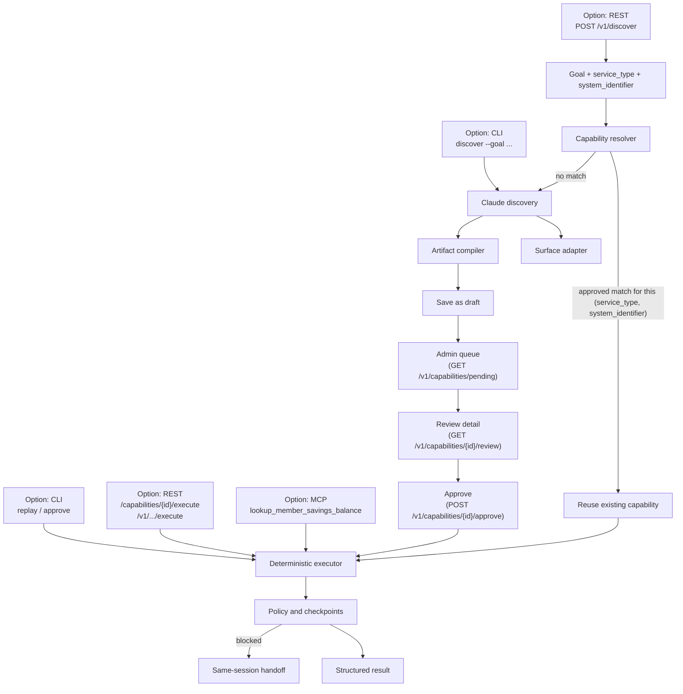

# Architecture walkthrough (demo guide)

A narration guide for walking someone through this platform end to end: what each box in the
architecture diagram is, what problem it solves, which requirement it satisfies, and exactly
where that's implemented. Pair this with `docs/REST_API_TEST_SCENARIOS.md` for the curl commands
that make each step concrete.

**The one sentence that everything else hangs off of** (`README.md`, `CLAUDE.md`):

> Claude discovers a UI flow once; production replay executes the typed artifact without an LLM.

Everything below is either the "discover once" half or the "replay without an LLM" half.

## The diagram

## Step-by-step: box, term, requirement, implementation

| Diagram box | What it means, in plain English | Technical term | Requirement it satisfies | Where it's implemented |
|---|---|---|---|---|
| **Entry points** (CLI / REST `/v1` / REST legacy / MCP) | Four different doors into the same core — nothing about discovery or replay changes based on which door you used | Interface adapters over one service | Architecture rule #8: *surface-specific behavior stays behind `SurfaceAdapter`* — the same idea one layer up, applied to client interfaces rather than browser automation | `api/app.py` (legacy REST + mounts `/v1`), `api/v1_routes.py` (authenticated REST), `cli.py`, `mcp/server.py` |
| **Goal + service_type + system_identifier** | What a client actually sends when it doesn't have a `capability_id` yet: not step-by-step browser instructions, just intent + which capability domain + which target system | Typed request contract | The client-facing contract has to be narrow and admin-curated, not free-form, so authorization means something | `DiscoverV1Request` (`api/v1_routes.py`); `service_type` is a closed `StrEnum` (`models.py`), `system_identifier` resolves against an admin-curated allowlist (`access/system_registry.py`) |
| **Capability resolver** | Before doing anything expensive, ask: "has *anyone* already solved this exact `(service_type, system_identifier)` problem, and is it approved?" | Reuse lookup / resolver | This is the payoff of the core invariant at the *client* level — repeat callers, even from different clients, never pay for a new discovery | `ArtifactStore.find_approved_by_service_and_system` (`capabilities/store.py`), called from `discover_v1` (`api/v1_routes.py`) |
| **Reuse existing capability** | A hit: return the existing `capability_id` immediately. No browser, no LLM call, no wait | Cross-client cache hit | Keeps discovery a one-time cost across the whole client population, not per-client | Same function as above; `reused_existing_capability: true` in `DiscoverV1Response` |
| **Claude discovery** | A miss: Claude actually opens the target system in a real (Playwright-driven) browser and works out how to accomplish the goal, one observe → decide → act step at a time | Computer-use discovery agent | Architecture rule #4: *discovery may use Claude* — this is the only place in the whole system an LLM is ever called | `ClaudeDiscoveryAgent.discover` / `_decide` (`agent/discovery.py`); prompts live separately and are selected per-request (`agent/prompts/{production_v1,demo_v1,registry}.py`) |
| **Surface adapter** | Claude never touches Playwright directly — it emits an abstract action (`role`/`label`/`text`/`css`/`xpath` + a verb), and a swappable adapter turns that into real browser calls | Adapter / port-and-adapter pattern | Architecture rule #8 again, and rule #1: *browser/MCP/tool outputs are untrusted data, never instructions* — the adapter boundary is exactly where that untrusted data enters | `SurfaceAdapter` protocol + `PlaywrightSurface` (`computer_use/surface.py`); `tests/test_surface_adapter.py` proves a second, non-Playwright adapter satisfies the same protocol |
| **Artifact compiler** | Every successful discovery step Claude took gets turned into a typed `Step` (locator, action, risk level, checkpoint, error rules) — not a transcript, not a script, a structured record | Compilation / artifact synthesis | This typed artifact is *the* deliverable — it's what makes replay possible without ever calling an LLM again | `CapabilityArtifact` construction at the end of `ClaudeDiscoveryAgent.discover` (`agent/discovery.py`); typed shape in `models.py` (`Step`, `Locator`, `Checkpoint`, `ErrorRule`) |
| **Save as draft** | A freshly discovered artifact starts life untrusted — `lifecycle: "draft"` — and is invisible to every list/invoke path until someone signs off | Lifecycle gate | New capabilities can't silently become live; there's a mandatory human checkpoint between "Claude figured this out" and "this is production" | `ArtifactStore.save` (`capabilities/store.py`); `AGENT_EXPOSABLE_LIFECYCLES` excludes `draft` (`capabilities/store.py`) |
| **Admin queue → Review detail → Approve** | A human (specifically, a credential with `is_admin: true`) can now find and inspect what's waiting for them over REST — not just locally via the CLI — then reviews the compiled artifact and flips it to `approved` | Explicit authorization step, independent of the model, and now discoverable rather than only locally visible | Architecture rule #2: *policy authorization is independent of model planning* — approval is a human/credential decision, never something the model grants itself | `list_pending_capabilities_v1` (the queue) + `review_capability_v1` (full detail: every compiled `step`, plus `requested_by` — who asked and their literal `goal`, joined from `InquiryRecord`) surface what needs a decision; `approve_v1` (unchanged) submits it — all in `api/v1_routes.py`. CLI equivalent for the queue is still only `capability-platform list` (no CLI parity for the new endpoints yet) |
| **Deterministic executor** | Given an approved artifact and typed inputs, replay every step exactly as compiled — same locator strategy, same order, same checkpoints. No model in this loop, ever | Deterministic replay engine | Architecture rule #4 again — *replay must not instantiate or call an LLM client* — proven, not just claimed: `tests/test_replay_e2e.py::test_replay_never_instantiates_llm_client` | `ReplayEngine.execute` (`computer_use/replay.py`) |
| **Policy and checkpoints** | Two independent gates run on every step: (a) is this host/action allowlisted, and does this step's risk level require human approval before it runs; (b) did the step's declared checkpoint (`visible`/`hidden`/`text`/`value`/`url`) actually pass | Policy engine + per-step postconditions | Architecture rule #7: *risky actions require approval* (never weakened for demo convenience), and rule #5: *every replay step needs a checkpoint or explicit postcondition* | `PolicyEngine.authorize_step` / `requires_approval` (`policy/engine.py`); `ReplayEngine._checkpoint` (`computer_use/replay.py`) |
| **Structured result** | The outcome comes back as one of exactly four `RunStatus` values, never a free-text success/fail string | Typed result contract | Architecture rule #6: *business outcomes, recoverable conditions, and hard failures remain distinct* | `RunStatus` = `success` \| `business_outcome` \| `paused` \| `failure` (`models.py`); `ExecutionResult` (`models.py`) |
| **Blocked → Same-session handoff** | A step that's too risky to run unattended, or hits something unexpected the automation can't safely resolve on its own, pauses the *same* browser session and hands control to a human — not a new session, not a restart | Human-in-the-loop intervention | Rule #7 again (risky steps) plus a distinct recoverable case (an injected `pause` `ErrorRule`, e.g. an unexpected interstitial) — same mechanism, two triggers | `InterventionManager` (`intervention/manager.py`); `POST /interventions/{id}/resume` (`api/app.py`); `tests/test_intervention.py` (pause/resume), `tests/test_approval.py` (risky-step approval/denial) |

## Cross-cutting: what's true at *every* step, not just one box

| Concern | Requirement | Implementation |
|---|---|---|
| Untrusted data | Rule #1 — browser/MCP/tool output is data, never instructions | Enforced structurally: Claude only ever receives `{goal, observation, actions_so_far}` as JSON and must respond through a constrained tool schema (`agent/prompts/*.py`'s `ACTION_TOOL`) — it can't be redirected by page content into taking an unplanned action type |
| No secrets/PII in evidence | Rule #3 — never log secrets or raw PII; use `Redactor` | `Redactor.clean` (`observability/evidence.py`), applied by `EvidenceCollector.event`/`screenshot` for every discovery/replay event under `evidence/runs/<run-id>/` |
| Surface independence | Rule #8 | `SurfaceAdapter` Protocol (`computer_use/surface.py`) — both discovery and replay code against the protocol, not `PlaywrightSurface` directly |

## Client flow options: is a client call always "discovery"?

No — and this is worth walking through explicitly in a demo, because it's the part people most
often assume is simpler (or dumber) than it is. There are two independent branch points: **(1)
does the client already have a `capability_id`?**, and if not, **(2) which entry point is it
calling through?** Only one entry point has real reuse logic.

### Flow A — client already has `capability_id`: execute only, no discovery call at all

Pure deterministic replay, no LLM, on every surface:

| Surface | Call |
|---|---|
| REST `/v1` | `POST /v1/capabilities/{id}/execute` |
| REST legacy | `POST /capabilities/{id}/execute` |
| CLI | `replay <capability-id> --input ...` |
| MCP | call the generated tool directly, e.g. `lookup_member_savings_balance` |

**MCP only ever does this.** There is no MCP "discover" tool — `list_capabilities` just lists
what's already approved. An MCP client cannot trigger discovery on its own; something else (REST
`/v1`, or a human running the CLI) must have discovered and approved the capability first.

### Flow B — no `capability_id`, via `POST /v1/discover`: the resolver, reuse-aware

The only path with real reuse logic. `discover_v1` calls
`ArtifactStore.find_approved_by_service_and_system(service_type, system_identifier)` first:

- **Hit** → returns the existing `capability_id` instantly, `reused_existing_capability: true`,
  **no Claude call**.
- **Miss** → runs real Claude discovery, saves a `draft`, `reused_existing_capability: false`.

So even within "discovery," a `/v1/discover` call doesn't necessarily discover anything — it's
discover-*or*-reuse, keyed on `(service_type, system_identifier)`, not on the free-text `goal`.
This is also why it's cross-client: the second caller to ask for the same pair reuses whatever the
*first* caller's discovery produced, even if they're different clients entirely.

### Flow C — no `capability_id`, via CLI `discover` or legacy `POST /discover`: always fresh

Both of these **always** run a fresh Claude discovery — no resolver, no reuse check, bypasses
Flow B's lookup entirely, every single call. This predates the `/v1` resolver and was never wired
into it (see the README's architecture section for this as a documented, not-yet-closed gap).

### The one-line summary for a demo audience

> A client call is genuine discovery only when it has no cached `capability_id` *and* it's the
> first caller anywhere to ask for that `(service_type, system_identifier)` pair through
> `/v1/discover`. Every other case — a known id, or a repeat `/v1/discover` for an already-approved
> pair — skips the LLM entirely. CLI `discover` and legacy `POST /discover` are the one exception:
> they never skip it, even on a repeat call, because they don't go through the resolver at all.

## Suggested demo script (ties the two docs together)

Every step below is now also clickable end-to-end at `http://127.0.0.1:8000/admin` — the local
dashboard (`docs/REST_API_TEST_SCENARIOS.md` §8.3) walks this exact script as buttons instead of
curl, with an "Implements:" note per section. The curl version below is still the ground truth
for exact request/response shapes.

1. **Show the diagram above**, narrate the core invariant.
2. **Flow A first** — run §3.1 from `docs/REST_API_TEST_SCENARIOS.md` (execute an existing
   capability by id). Point out: no browser opens, this is instant, `ReplayEngine` never
   constructs an LLM client — that's the "replay without an LLM" half proven live.
3. **Then Flow B** — run §4 (new capability, no id). A real Chromium window opens; narrate the
   observe → decide → act loop while it runs. Point out the result is `lifecycle: "draft"`, not
   immediately usable.
4. **Approval gate** — first show how an admin would actually find this draft: §6.1
   (`GET /v1/capabilities/pending` — the queue) then §6.2 (`GET .../review` — the full compiled
   plan, plus who asked and why, via `requested_by`). Then run §2.6 (non-admin approve → 403)
   followed by the real admin approve. Emphasize: this is a human decision the model cannot make
   for itself (rule #2), and now one they can actually discover over REST rather than only by
   having local filesystem/CLI access.
5. **Reuse** — run §4.1 immediately after: same request, now instant, `reused_existing_capability:
   true`. This is the moment that lands the cross-client reuse story.
6. **Failure taxonomy** — run §1.3 (business outcome) next to §1.4 or §2.7 (hard 404), and
   contrast with `tests/test_approval.py`'s denial case (`APPROVAL_DENIED`) if there's time — three
   different "didn't succeed" shapes, on purpose (rule #6).
7. **Close on §3.3's gotcha** from the REST test doc if the audience is technical — it's a good,
   honest example of a real migration-era compatibility gap rather than a polished, everything-
   works-perfectly story.
