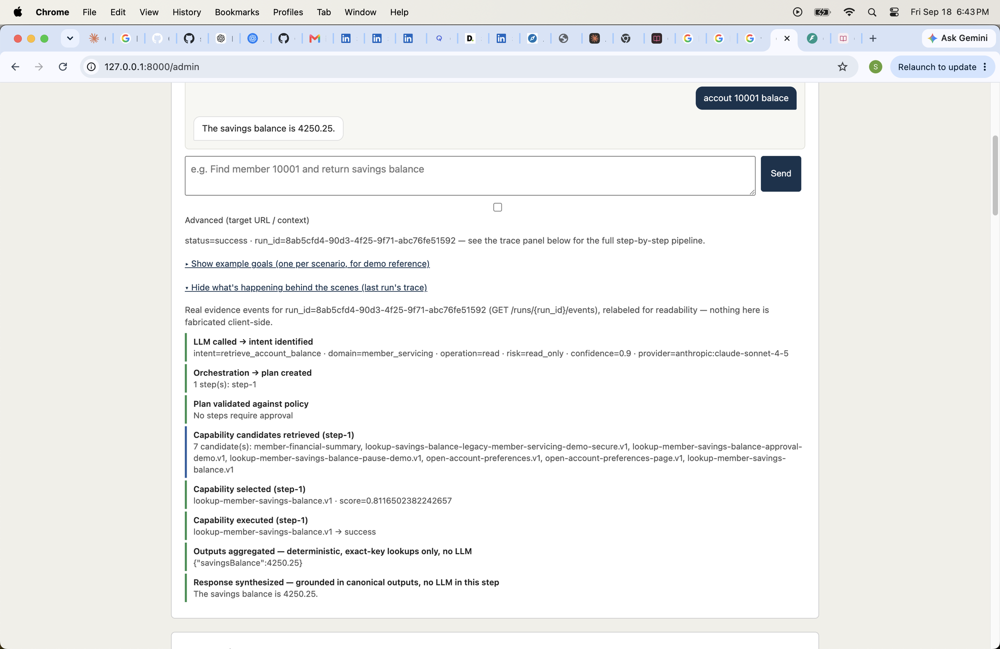
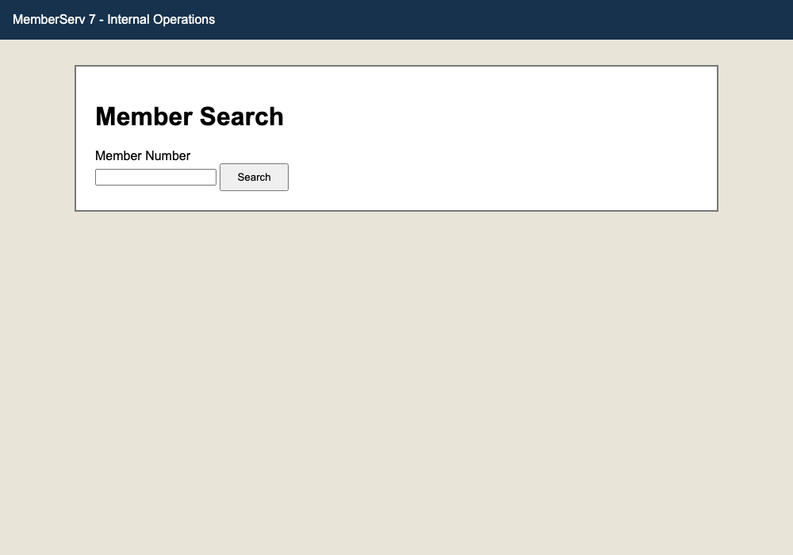
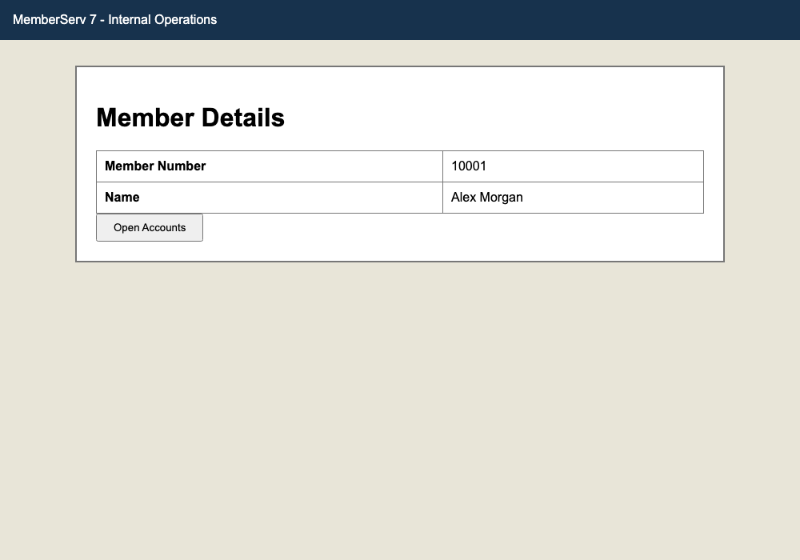
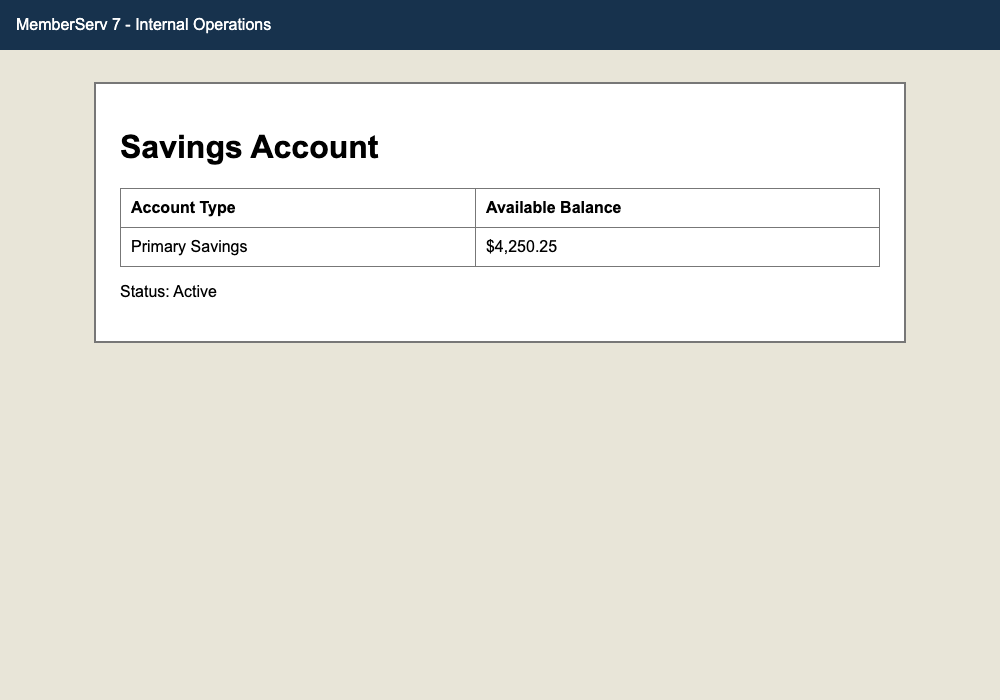
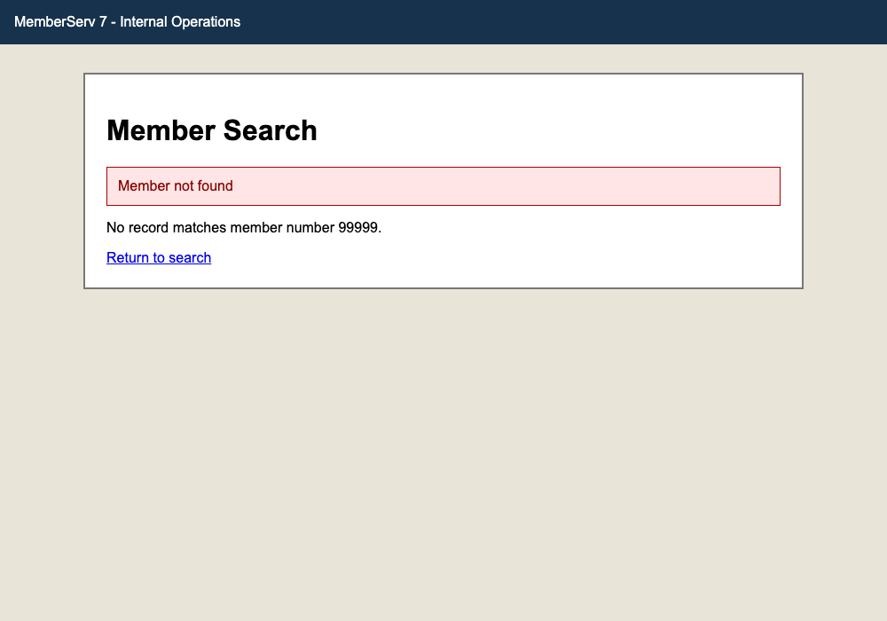
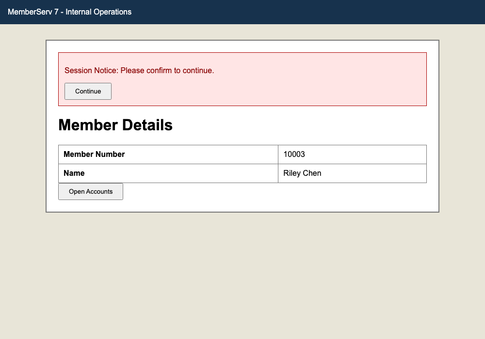

# Demo walkthrough: chatbot → guardrails → discovery → artifact → replay → error → escalation

A guided tour of the full vertical slice, with screenshots of the actual target app
(`demo_app`, "MemberServ 7 - Internal Operations") and the admin console (`GET /admin`) at each
stage. This is a curated summary for a reviewer skimming quickly — the authoritative detail lives
in `/README.md`, `/REPORT.md`, and `/evidence/INDEX.md`. §§1–2 lead with the newer goal-driven
chatbot entry point and its guardrails; §§3–7 walk the original CLI-driven discover → artifact →
replay → error → escalation slice underneath it.

## The goal

> Find member 10001 and return savings balance

Target: `demo_app/app.py`, a small FastAPI app standing in for a legacy internal
member-servicing tool — plain server-rendered HTML, no test IDs, deliberately close to the
"legacy web app" reality described in the assignment brief.

## 1. The newer entry point: goal-driven chatbot

A named-capability CLI call isn't how a real user would reach this system. The admin console
(`GET /admin`) adds a chatbot-style entry point instead — type a goal in plain English, no
capability id, no inputs form — that routes through the full `AgentOrchestrator` pipeline (Intent
Analyzer → Planner → PlanValidator → CapabilityResolver → Executor → `GroundedSynthesizer`,
`agent/orchestrator.py`; `REPORT.md` §1 has the design). A live, real interaction, screenshot and
evidence both captured from an actual run — including the typo, unedited:



Real captured evidence from this exact run, `evidence/runs/8ab5cfd4-90d3-4f25-9f71-abc76fe51592/events.jsonl`:

```json
{"event": "intent.analyzed", "intent": {"intent": "retrieve_account_balance", "entities": [{"name": "memberId", "value": "10001"}], "required_outputs": [{"name": "accountBalance", "type": "number"}], "confidence": 0.9, "raw_goal": "accout 10001 balace", "provider": "anthropic:claude-sonnet-4-5"}}
{"event": "capability.candidates_retrieved", "step_id": "step-1", "candidate_count": 7}
{"event": "capability.selected", "step_id": "step-1", "descriptor_id": "lookup-member-savings-balance.v1", "final_score": 0.8116502382242657}
{"event": "capability.executed", "step_id": "step-1", "descriptor_id": "lookup-member-savings-balance.v1", "status": "success"}
{"event": "result.aggregated", "outputs": {"savingsBalance": 4250.25}}
{"event": "result.synthesized", "text": "The savings balance is 4250.25.", "status": "success"}
```

Two things worth pointing out in this one real run: the typo'd goal ("accout 10001 balace") still
correctly resolved to `retrieve_account_balance`/`memberId=10001` — real language tolerance, not a
scripted happy path — and the model's own `required_outputs` named the field `accountBalance`,
which does **not** match the plan's actual key (`savingsBalance`, from `result.aggregated`). The
response text is still correct (`"The savings balance is 4250.25."`) because
`GroundedSynthesizer` reads the deterministic `outputs` dict directly rather than filtering
through that LLM-derived field — the fix for a real bug found live earlier in this same session
(`REPORT.md` §3 has the full story; `evidence/README.md` has the exact before/after run pair that
was silently dropping this same kind of value before the fix).

## 2. Guardrails — refused or clarified before any browser action

Three goal shapes never reach the Planner at all; the Intent Analyzer's own structured output
carries the flag, checked by the orchestrator before any plan/resolve/execute step runs
(`REPORT.md` §6). All three below are genuine runs, not scripted for this doc.

**Genuinely unclassifiable goal → clarification, not a guess.**
`evidence/runs/5aafbc96-6895-4184-af99-85b6e1acb262/events.jsonl`:
`requires_clarification=true`, `clarification_question="What would you like help with today?"` —
the model asks instead of proceeding on a placeholder.

**A pure conversational message, misidentified as ambiguous — a real bug, found and fixed.**
`evidence/runs/a5678129-df7f-474f-b816-cc29abdf1930/events.jsonl` is the exact run behind that
bug: a plain acknowledgment ("thank you," effectively) was routed through the same
`requires_clarification` path above instead of getting a plain reply. Fixed by adding a third,
sibling flag, `is_conversational` — checked first, answered with the model's own short reply, no
plan built at all.

**A goal with no sensible business meaning on the target → clean failure, never a crash.**
`evidence/runs/bc0fa3df-26cd-4ff7-a029-1514a71ee5f5/events.jsonl` → fixed in
`evidence/runs/2450b42c-f3da-4626-bce2-210a954ef8ae/events.jsonl`: same goal shape
("open \[a/su/sub\] account for 10001"), correctly falls through to a live discovery attempt,
which correctly can't find anything to do — but the *first* run's response text leaked a raw
Python exception class name (`(LookupError)`) and the raw snake_case intent id (`'open_account'`)
into the chat response. The second run shows the fix: humanized intent name, no internal
exception detail, same clean `DISCOVERY_FAILED` result either way — the failure itself was always
correct (`REPORT.md` §3/§6); only the wording changed.

**Per-client credentials — set up in either order, not documented with a fresh screenshot here**
(no new UI chrome to show beyond the "Save credentials" dropdown form already described in
`TASKS.md`'s Phase 21/22 logs), but real, captured, live-verified end to end there: a login-gated
capability can have credentials attached before *or* after approval, and two different clients
get their own independently-stored logins against the exact same capability.

## 3. Discovery (LLM-driven)

```
uv run capability-platform discover --goal "Find member 10001 and return savings balance"
```

Claude drives a live browser session against the app, observing the accessibility tree, deciding
an action, and acting — repeated until the goal is met. Real captured evidence from this run is
in `evidence/runs/8dcc3190-.../events.jsonl`:

```json
{"event": "discovery.observed", "step": 0, "observation": {"url": "http://127.0.0.1:8001/",
  "accessibility": "- banner: MemberServ 7 - Internal Operations\n- main:\n  - heading \"Member Search\"..."}}
{"event": "discovery.decided", "step": 0, "decision": {"action": "type", "strategy": "label",
  "value": "Member Number", "typed_value": "10001"}}
{"event": "discovery.acted", "step_id": "step-1", "action": "type"}
```

What the model saw, step by step:

| Search form | Member detail | Savings balance |
|---|---|---|
|  |  |  |

## 4. The resulting artifact

The successful run is compiled into a typed, versioned capability
(`artifacts/lookup-member-savings-balance.v1.json`, `lifecycle: "approved"`). It's a contract, not
a transcript — decoupled from the raw model reasoning above:

```json
{
  "id": "lookup-member-savings-balance",
  "version": 1,
  "lifecycle": "approved",
  "inputs": [
    {"name": "memberId", "type": "string", "required": true, "pattern": "^\\d{5}$"}
  ],
  "outputs": [
    {"name": "savingsBalance", "type": "number"}
  ],
  "steps": [
    {
      "id": "step-1", "action": "type", "risk": "read_only",
      "target": {"primary": {"strategy": "label", "value": "Member Number"}},
      "value": "{{memberId}}"
    },
    {
      "id": "step-2", "action": "click", "risk": "read_only",
      "target": {"primary": {"strategy": "role", "value": "button", "name": "Search"}},
      "errors": [{"code": "MEMBER_NOT_FOUND", "category": "business"}]
    }
  ]
}
```

`REPORT.md` §2 explains the schema's design rationale (typed I/O, per-step locators with
fallbacks, declared errors as first-class citizens, not exceptions bolted on afterward).

## 5. Deterministic replay — success

```
uv run capability-platform replay lookup-member-savings-balance.v1 --input memberId=10002
```

```json
{
  "run_id": "bb60efcf-ddb9-4f2a-a58a-30dc1ca4445b",
  "status": "success",
  "outputs": { "savingsBalance": 1220.0 },
  "business_code": null,
  "error": null
}
```

No LLM in the loop — this is the same artifact recorded against member `10001`, now correctly
replaying against a *different* member (`10002`), because inputs are parameterized rather than
baked into the recording.

## 6. Replay hitting an error / exceptional state

```
uv run capability-platform replay lookup-member-savings-balance.v1 --input memberId=99999
```

```json
{
  "run_id": "afe88446-3ab1-440f-a34a-0c0f128f84bf",
  "status": "business_outcome",
  "outputs": {},
  "business_code": "MEMBER_NOT_FOUND",
  "error": null
}
```



"No such member" is reported as a `business_outcome`, not a crash — the result contract
distinguishes this from a hard failure. Two other error categories are exercised elsewhere in
`/evidence/`, matching the taxonomy in `REPORT.md` §3:

- **Hard failure (checkpoint_failed)** — `evidence/runs/33549c65-.../events.jsonl`: an injected
  broken locator surfaces as
  `{"category": "checkpoint_failed", "message": "label:Nonexistent Label That Does Not Exist matched 0", "recoverable": false}`,
  with a failure screenshot attached.
- **Business outcome (alternate run)** — `evidence/runs/ff5b2a3c-.../events.jsonl`: another
  `MEMBER_NOT_FOUND` replay captured independently, for cross-run consistency.

## 7. Escalation & handoff

Member `10003` always triggers an unexpected session interstitial in the demo app — a condition
the recorded artifact doesn't know how to dismiss, so replay treats it as a stuck state rather
than guessing:



When this happens, the system raises an intervention request (capability, step, current state,
and the reason it stopped), pauses the run, and lets a human operate the *same* live session —
not a fresh one — before signaling resume. `REPORT.md` §5 details the pause/resume mechanics and
control-ownership model; `evidence/runs/*/pause-*.png` and `approval-step-*.png` capture the
handoff screenshots from real intervention runs.

## Further detail

- `/README.md` — full setup, run, and command reference.
- `/REPORT.md` — architecture, schema, determinism/error-handling, heterogeneity/multi-tenant,
  escalation, safety, and cuts — the seven required sections.
- `/evidence/INDEX.md` — the complete map of which run/file satisfies which requirement, across
  200 captured runs.
- `/TASKS.md` — phase-by-phase build log, including every live-verification run for the
  goal-driven pipeline, guardrails, and credentials work referenced above.
